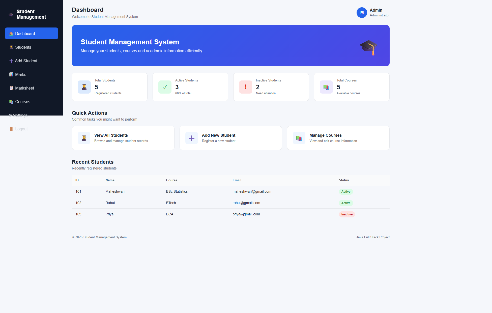
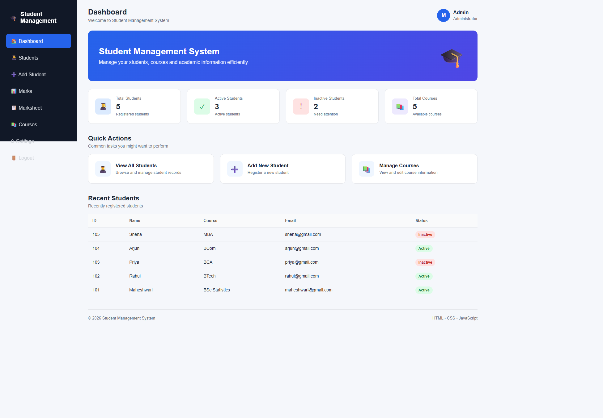

# Student Management System

A student management web application built with HTML, CSS, and JavaScript.

## Output

### Dashboard

### Login

### Student Registration

## Run the project

Open `Student_Management_System/index.html` in a web browser.